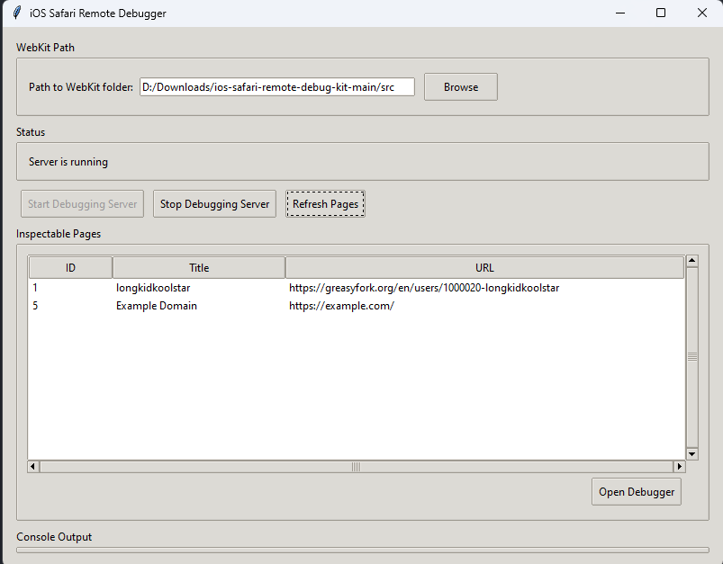

```markdown
# 🧭 iOS Safari Remote Debugger GUI

A simple graphical interface built with Python and Tkinter to help developers debug Safari on iOS devices using Apple's WebKit Remote Debugging Protocol.
```


---
```markdown
## 📦 Features

- ✅ **One-click Auto Setup** of WebKit environment
- ✅ Save and remember WebKit folder path
- ✅ Start/stop WebKit remote debugging server
- ✅ List inspectable Safari tabs in real-time
- ✅ Direct DevTools access for selected pages
- ✅ Built-in console logging
- ✅ Cross-platform support (Windows, macOS, Linux)

---

## 🚀 Getting Started

### 🔧 Requirements

- Python 3.7+
- Git (for auto-setup)
- Pip packages: `requests`, `beautifulsoup4`
```


```bash
pip install requests beautifulsoup4
```


---

## 🌀 Auto Setup Feature

1. **Launch the application**
```bash
python main.py
```

2. **Click the "Auto Setup WebKit" button**
   - Select your desired installation directory
   - The tool will automatically:
     - Clone the required repository
     - Generate WebKit files
     - Set up start scripts
     - Configure paths

3. **Wait for completion**  
   A progress window will show real-time updates during:
   - Repository cloning
   - WebKit generation
   - File copying


---

## 🔧 Manual Setup from Source

1. Clone this repository:
```bash
git clone https://github.com/longkidkoolstar/IOS-Debugger.git
cd IOS-Debugger
```

2. Run the GUI:
```bash
python main.py
```

3. Manually select your WebKit folder containing:
   - `start.sh` (Linux/macOS)
   - `start.ps1` (Windows)
   - `WebKit/` directory

---

## 📦 Prebuilt Executable

Windows users can download the standalone executable:

[](https://github.com/longkidkoolstar/IOS-Debugger/releases/latest)

---

## 🧪 Usage

1. **Start Debugging Server**  
   Click the power button to launch local server

2. **Refresh Pages**  
   Load currently active Safari tabs from connected iOS devices

3. **Open DevTools**  
   Select a page and click "Open Debugger" or double-click entries

---

## 🗂 Folder Structure After Auto-Setup

```
your_selected_directory/
└── src/
    ├── WebKit/         # WebInspector files
    ├── generate.ps1    # Windows setup script
    ├── generate.sh     # Linux/macOS setup script
    ├── start.ps1       # Windows launch script
    └── start.sh        # Linux/macOS launch script
```

---

## 💡 Important Notes

- First-run setup requires internet connection to clone repository
- Ensure iOS device has Web Inspector enabled:
  `Settings → Safari → Advanced → Web Inspector`
- Keep iOS device unlocked and connected via USB during debugging
- Firewall should allow ports 8080 (HTTP) and 9222 (WebSocket)

---

## 📜 License

MIT License - [LICENSE](LICENSE)

---

## 🙏 Credits

Developed by [longkidkoolstar](https://github.com/longkidkoolstar)  
WebKit setup automation based on [ios-safari-remote-debug-kit](https://github.com/HimbeersaftLP/ios-safari-remote-debug-kit)


