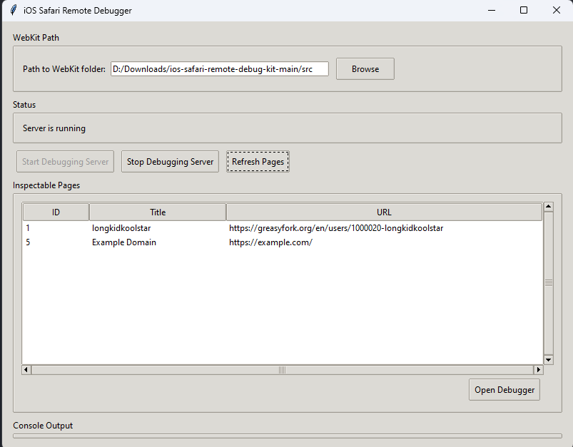

---

```markdown
# 🧭 iOS Safari Remote Debugger GUI

A simple graphical interface built with Python and Tkinter to help developers debug Safari on iOS devices using Apple's WebKit Remote Debugging Protocol.

This tool allows you to:
- Start and stop the local WebKit remote debugging server
- View a list of inspectable pages on connected iOS Safari instances
- Open the Safari DevTools for a selected page directly in your browser

---

## 📦 Features

- ✅ Save and remember WebKit folder path
- ✅ Start/stop WebKit remote debugging server with a click
- ✅ List all currently available inspectable Safari tabs
- ✅ Open Safari's DevTools UI for selected pages
- ✅ Console log output built-in
- ✅ Cross-platform support (Windows, macOS, Linux)

---

## 🚀 Getting Started

### 🔧 Requirements

- Python 3.7+
- Pip packages: `requests`, `beautifulsoup4`

You can install the requirements using:

```bash
pip install requests beautifulsoup4
```

---

## 🛠️ Setup from Source

1. Clone this repository:

```bash
git clone https://github.com/longkidkoolstar/IOS-Debugger.git
cd IOS-Debugger
```

2. Run the GUI:

```bash
python main.py
```

3. Select your local **WebKit folder** (containing `start.sh` or `start.ps1`) via the "Browse" button.

> ⚠️ Make sure your iOS device is connected and Safari is open with Web Inspector enabled.

---

## 📦 Download (Prebuilt)

No Python setup required! Download the latest prebuilt `.exe` from the releases page:

🔗 [Download main.exe from GitHub Releases →](https://github.com/longkidkoolstar/IOS-Debugger/releases/tag/V1.0.0)

Assets:
- 🗂 [IOS-Debugger.zip](https://github.com/longkidkoolstar/IOS-Debugger/releases/download/V1.0.0/IOS-Debugger.zip)
- ⚙️ [main.exe](https://github.com/longkidkoolstar/IOS-Debugger/releases/download/V1.0.0/main.exe)
- 🧾 [Source Code (zip)](https://github.com/longkidkoolstar/IOS-Debugger/archive/refs/tags/V1.0.0.zip)
- 🧾 [Source Code (tar.gz)](https://github.com/longkidkoolstar/IOS-Debugger/archive/refs/tags/V1.0.0.tar.gz)

---

## 🧪 Usage

- Click `Start Debugging Server` to launch the local server.
- Click `Refresh Pages` to load currently opened tabs on your iOS device.
- Select any page from the list and click `Open Debugger` to open Safari DevTools in your browser.
- Double-clicking a page also opens it directly.

---

## 📁 Folder Structure

```
.
├── main.py                   # The main application file
├── main.exe                  # Precompiled executable (Windows only)
├── screenshots/
│   └── ui.png                # Screenshot of the GUI
├── README.md                 # This file
└── .ios_safari_debugger.ini  # Auto-generated config file (saves WebKit path)
```

---

## 📸 Screenshots



---

## 💡 Notes

- This tool does **not** include WebKit itself. You need to [build WebKit from source](https://webkit.org) or use a precompiled version with `start.sh` or `start.ps1`.
- Make sure port `9221` is available and not blocked by firewalls.
- Tested on Windows 10. macOS and Linux should work if you run the `.py` script manually.

---

## 📜 License

This project is licensed under the MIT License. See the `LICENSE` file for more info.

---

## 🙏 Credits

Built by [longkidkoolstar](https://github.com/longkidkoolstar). Inspired by Apple's WebKit DevTools and the desire for a simple UI to debug iOS Safari.


